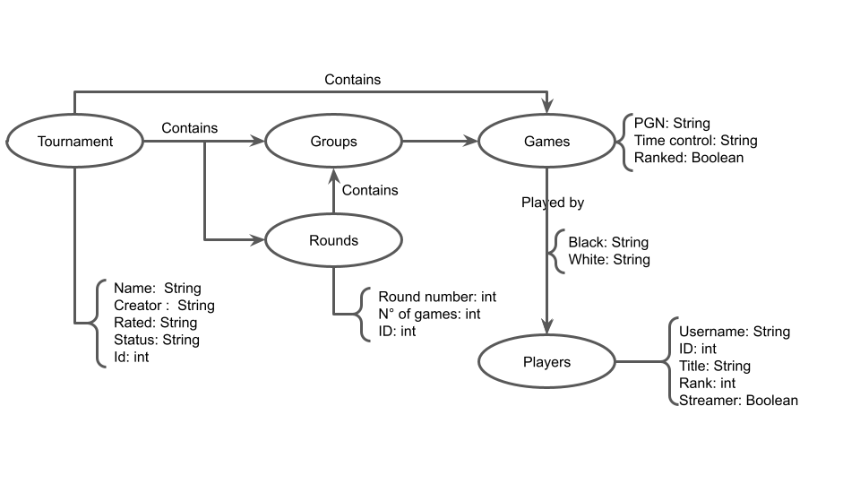

# Modelo Lógico e Análise de Dados em Grafos

# Equipe `BispOSet` - `BOSS`
* `Breno Nunes Tavares` - `RA: 232238`
* `Eduardo Carvalheira Teixeira de Aguiar` - `RA: 233686`
* `Enrico Piovesana Fernandes` - `RA: 233895`

## Modelo Lógico Combinado do Banco de Dados de Grafos
> Coloque aqui o modelo ou modelos que serão usados pela equipe combinando os individuais, conforme especificação.
> Utilize este [modelo de base](https://docs.google.com/presentation/d/10RN7bDKUka_Ro2_41WyEE76Wxm4AioiJOrsh6BRY3Kk/edit?usp=sharing) para construir o seu.
>
> Segue o modelo criado pela combinação de todos os modelos:
> 

## Perguntas de Pesquisa/Análise Combinadas e Respectivas Análises

> Liste aqui as perguntas de pesquisa/análise combinadas e revisadas dos membros da equipe e respectivas análises.
>
### Pergunta/Análise 1
> * Se um jogador for banido/removido do banco de dados, seja por motivos legais ou quaisquer outros, quais impactos seriam sentidos na eficiência do banco de dados?
>   
>   * Isso é um problema de vulnerabilidade, pois embora seja possível remover um jogador específico, todos os jogos em que ele participou ainda estariam presentes no banco de dados, e quando for desejado recuperar um jogo específico em que um jogador removido participou no passado, seria necessário analisar todos os jogos já jogados para encontrá-los, causando um impacto grande na eficiência do banco de dados.

### Pergunta/Análise 2
> * Pergunta 2
>   
>   * Explicação sucinta da análise que será feita no grafo para atender à pergunta. Deve ser indicado explicitamente em qual das modalidades a análise se encaixa: centralidade; vulnerabilidade; comunidade/modularidade; motifs; predição de links.

### Pergunta/Análise 3
> * Pergunta 3
>   
>   * Explicação sucinta da análise que será feita no grafo para atender à pergunta. Deve ser indicado explicitamente em qual das modalidades a análise se encaixa: centralidade; vulnerabilidade; comunidade/modularidade; motifs; predição de links.
